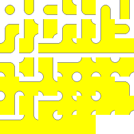

## Blobator

Blobator creates 47 tile 'blob' tilesets, either as templates or by assembling from sub or microblobs. For an explanation of the concepts involved please read [this post](http://personal.boristhebrave.com/tutorials/tileset-roundup), although the details of implementation differ somewhat for blobator. In short, these 47 tile blobs can be used to easily render terrain by assigning bit values to the surrounding neighbors of the same type as the tile being inspected, using bitwise OR operations to add the values together producing a 0-255 index which points to one of the tiles in the blob.

Download a [zipped version of the binaries](Blobator.zip) or clone this repository to build the project.

## Command Line Usage

```
Usage: blobator.exe <size> <filename without extension>
  If filename is unspecified, 'blob' is used.
Options:
  -pow2, -poweroftwo: fit output image to power of 2 size
  -indent, -indented: indent json output
  -source <filename>: assemble tiles from subtiles
  -index: draw lowest tile index on template
  -font <family> <size>: specify font to use for text rendering
```

Using blobator will create a tileset template with tiles of the specified size. It will create two files, a png file containing the tileset image, and a json file containing information on how to parse the image.

Blobator can also be used to assemble 47 tile blobs from 20 tile subblobs or 13 tile microblobs by using the '-source' command line option. Instead of generating a template using the built-in graphics, the half-size tiles contained in the sub or microblob will be used to assemble the tileset instead by combining 4 images per tile, one for each corner. Templates for sub and microblob source images designed for a 32 pixel size tileset are contained in the Templates folder.

### Template Image ###

Blobator template images look like the following example.



### Template JSON Example ##

Blobator tileset JSON contain three parts of information:

* "image": The image filename to use for this tileset.
* "bits": A section describing which 8 values are used to create a single 0-255 tile index using neighboring tiles.
* "tiles": A section describing all tiles in this tileset, including their location in the image and which indices correspond to the tile.

It is formatted like the below excerpt of [example.json](example.json).

```json
{
  "image": "blob.png",
  "bits": {
    "topLeft": 1,
    "top": 2,
    "topRight": 4,
    "right": 8,
    "bottomRight": 16,
    "bottom": 32,
    "bottomLeft": 64,
    "left": 128
  },
  "tiles": [
    {
      "source": {
        "x": 0, "y": 0, "width": 32, "height": 32
      },
      "indices": [
        0, 1, 4, 5, 16, 17, 20, 21, 64, 
        65, 68, 69, 80, 81, 84, 85
      ]
    },
    (...)
  }
}
```

## Code Example

Blobator can be used as a C# library by adding a reference to 'Blobator.exe':

```csharp
Blobator.Generator.Generate(32, "blobtest");
```

A file 'BlobTileset.cs' is also included with Blobator. This file can be included in your projects to easily load and manage tileset blobs generated by Blobator. To implement, subclass BlobTileset, passing it an image type and a type that contains your image regions, and implement the LoadImage and LoadRegion functions, for example:

```csharp
using Blobator.Tileset;
using System;
using System.Collections.Generic;
using System.Drawing;
using System.Linq;

namespace BlobatorExample {
    public class ExampleTileset : BlobTileset<Bitmap, Rectangle> {
        protected override Bitmap LoadImage(string path) {
            return Bitmap.FromFile(path) as Bitmap;
        }

        protected override Rectangle LoadRegion(Bitmap image, int x, int y, int width, int height) {
            return new Rectangle(x, y, width, height);
        }

        public ExampleTileset(string path)
            : base(path) {
        }
    }
}
```

You can then load and use tilesets in the following way:

```csharp
var tileset = new ExampleTileset("example.json"); // load the tileset from json
var image = tileset.Image; // the base tileset image

var region = tileset[0]; // the region for tile index zero
region = tileset.GetTile(5); // alternate way of indexing

region = tileset[
    tileset.IndexFromTiles(true, false, true, true, true, false, true, true)
]; // get region for tile index corresponding to specified neighbors
region = tileset.GetTile( // get region from specified neighbors directly
    true, false, true, true, true, false, true, true);
```

## Motivation

While using the bitwise style of indexing using tile neighbors to figure out which tile to draw is an efficient way of rendering tiles, the implementation of both art assets as well as code can be finnicky. Blobabor exists to ease this process.

## Tests

Blobabor comes with a suite of tests designed to test the utility's output and BlobTileset's handling of it. To run this simply run the BlobaborTest project.

## Contributors

Contributions are welcome, particularly implementations of the BlobTileset class for other languages.

For more information you can contact Eniko at [@Enichan](https://twitter.com/Enichan) on Twitter.

## License

Blobabor is licensed under the MIT License.
